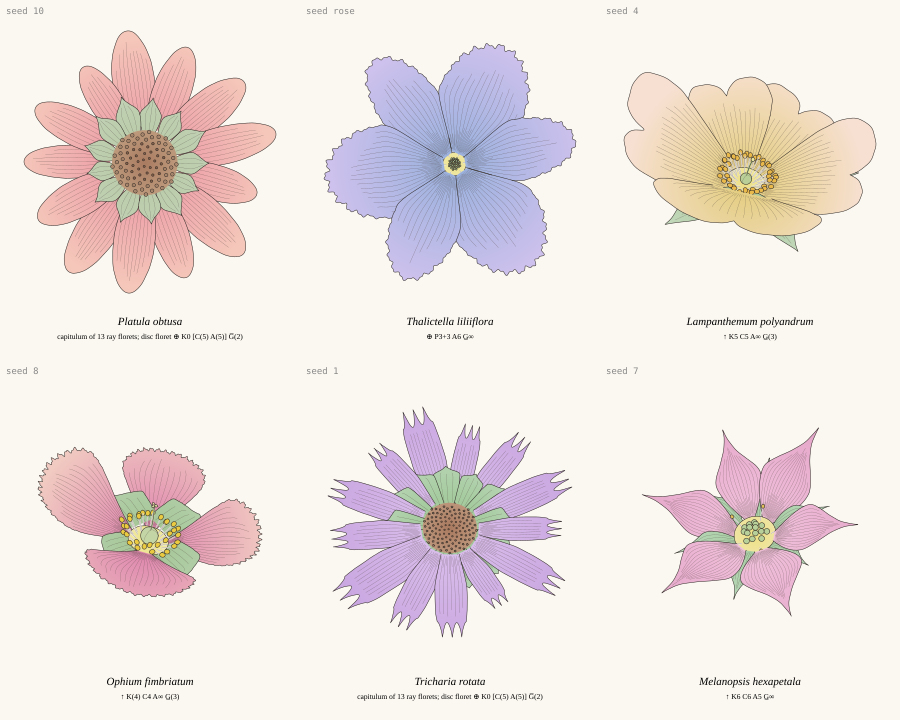
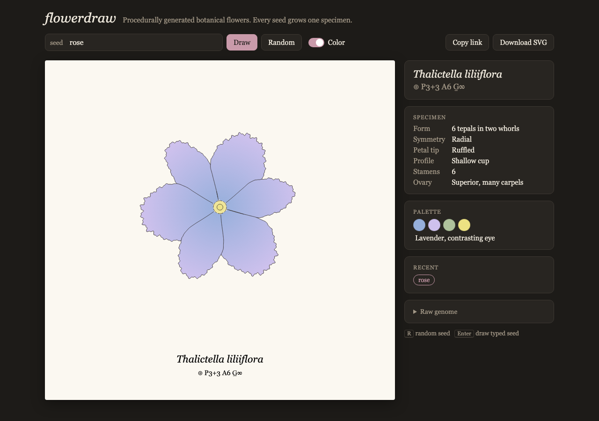
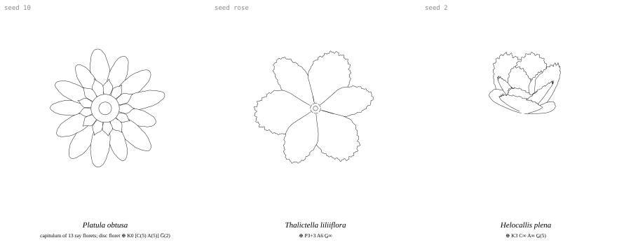

# flowerdraw

**Procedurally generated botanical flowers, drawn like a vintage engraving.**

Give flowerdraw a seed (any number or word) and it grows one flower. The same
seed always gives the same flower. Each flower starts from a real botanical
*floral formula*, the shorthand botanists use to describe a flower's parts.
That formula is then drawn as line art, colored with pastel washes, and
labeled with an invented Latin name.

Inspired by Lingdong Huang's [fishdraw](https://github.com/LingDong-/fishdraw).



## Features

- **Seeded:** a seed can be text or a number, and it always produces the same flower.
- **Based on botany:** the flower is generated from a floral formula
  (e.g. `⊕ K5 C5 A∞ G̲(3)`). The formula sets the petal count, symmetry, fused
  or free parts, double flowers, and daisy-type composite heads.
- **Varied shapes:** petal outlines are built from Bézier curves, with pointed,
  rounded, notched, three-toothed, fringed or ruffled tips. Petals are bent in
  3D (cupped, curled, reflexed) and the flower is drawn from a tilted
  viewpoint.
- **Hidden-line removal:** organs in front hide the lines behind them, so the
  output is clean single-stroke paths that a pen plotter can draw.
- **Two looks:** pastel watercolor washes under the ink, or plain line art for
  plotters.
- **Invented Latin names** that describe the flower: *Helocallis plena* is a
  double flower and *Melanaria fimbriata* has fringed petals.
- **No dependencies:** one JavaScript file that runs in the browser and in Node.

## Quick start

Clone the repo; there is nothing to install.

### In the browser

```sh
open index.html
```



- Type a seed or press **R** for a random one.
- Turn color on or off with the **Color** switch.
- **Download SVG** saves the current flower.
- The seed is stored in the URL (`index.html#rose`), so **Copy link** shares a
  specific flower.

### From the command line

Requires Node.js.

```sh
node flowerdraw.js --seed rose > rose.svg       # one flower as SVG
node flowerdraw.js --seed rose --mono > r.svg   # line art only, for a pen plotter
node flowerdraw.js --seed rose --genome         # the flower's genome as JSON
node flowerdraw.js > random.svg                 # random seed (printed to stderr)

node tools/sheet.js 1 2 3 rose lily daisy > sheet.svg   # several flowers on one sheet
#   --cols N   columns (default 3)
#   --mono     line art only
#   --bare     hide the "seed …" captions
```

### As a library

```js
// Node
const flowerdraw = require('./flowerdraw.js');
// Browser: <script src="flowerdraw.js"></script> defines window.flowerdraw

const { genome, svg } = flowerdraw.generate('rose', { color: true });
```

| Option | Default | |
|---|---|---|
| `width`, `height` | `600`, `720` | Canvas size in SVG units |
| `color` | `true` | Pastel washes under the linework; `false` gives line art only |
| `labels` | `true` | Latin name and floral formula under the drawing |
| `stroke` | `0.9` | Line width |

`generate` returns `{ genome, lines, fills, svg }`. `lines` holds the visible
polylines after hidden-line removal and `fills` holds the color polygons,
farthest first. To run the stages separately, call `makeGenome(seed)`, then
`draw(genome, opts)`, then `toSVG(genome, drawing, opts)`.

## Pen-plotter output

With `--mono` (or `{ color: false }`) the SVG contains only stroked paths: no
fills, no overlapping hidden lines.



The name and formula are SVG `<text>` in their own `<g id="labels">` group.
Remove or hide that group before plotting. Single-stroke lettering is on the
roadmap.

## How it works

```
seed ─► genome ─────────────────────────► parts ──────────► occlusion ─► SVG
        formula  (K C A G, symmetry)      drawPerianth      nearest first;
        head     (whorls, petal shapes)   drawCenter…       strokes clipped by
        pose     (tilt / spin / roll)     (one function     outlines of nearer
        color    (pastel palette)          per organ)       items
        name     (from formula + head)
```

1. **Floral formula.** Generated first. It records the counts of sepals (`K`),
   petals (`C`), tepals (`P`), stamens (`A`) and carpels (`G`). It also
   records symmetry (`⊕` radial or `↑` bilateral), whether parts are fused
   (written in parentheses), and whether the ovary sits above or below the
   petals (underline or overline on `G`).
2. **Morphology.** Generated from the formula. The flower head is a list of
   whorls (rings of organs). Each whorl has a count, angle, length, cup and
   curl, plus a petal-shape gene. Petal width comes from the count and an
   overlap factor, so star-shaped flowers with gaps and fully overlapping
   rose-like flowers use the same rule.
3. **Geometry.**
   - **Outline:** each petal outline is a few cubic Béziers, mirrored, with
     the edge displaced for wobble, fringes or ruffles.
   - **Bending:** the outline is bent into 3D along a curved midrib.
   - **Projection:** the whole head is rotated by the pose and projected.
4. **Hidden-line removal.** Each organ becomes an item: an outline polygon
   plus strokes. Items are sorted nearest first, and each item's strokes are
   clipped by the outlines of every nearer item. This is the same approach
   fishdraw uses.
5. **Color.** Pastel radial gradients are painted farthest first, using the
   same outlines, under the ink.

### Seeds and stability

Each part of the genome (formula, head, pose, color, name) draws its random
numbers from its own stream, seeded from the seed plus the part's name
(cyrb128 hash → sfc32 generator). Adding a new part of the genome, such as
stems, will not change how existing seeds look.

<details>
<summary><b>Genome reference</b></summary>

```js
{
  version: 1,
  seed: "rose",
  name:    { genus: "Thalictella", epithet: "liliiflora", full: "Thalictella liliiflora" },
  formula: {
    capitulum: false,               // true: composite head; the formula describes one disc floret
    merosity: 3,                    // base organ count per whorl
    symmetry: "actinomorphic",      // | "zygomorphic"
    perianth: "tepals",             // | "differentiated" (separate K and C)
    K: { n, fused } | null,         // calyx (sepals)
    C: { n, whorls, fused } | null, // corolla (petals); whorls > 1 means a double flower
    P: { n, whorls: 2 } | null,     // tepals
    A: { n, fused, epipetalous },   // stamens; n may be Infinity
    G: { n, fused, position },      // carpels; position "superior" | "inferior"
  },
  formulaText: "⊕ P3+3 A6 G̲∞",
  head: {
    type: "simple" | "double" | "radiate",
    radius, centerRadius,
    aestivation: "imbricate" | "contort" | "valvate",
    zygo: null | { mode: "banner" | "lip", strength, gather },
    whorls: [                       // outermost first
      { organ: "sepal" | "petal" | "tepal" | "ray" | "bract",
        layer, count, offset, r0, length, cup, curl, jitter, zygo,
        shape: { width, widthPos, belly, claw, overlap,
                 tip: "pointed" | "rounded" | "notched" | "frilled" | "toothed",
                 acumen, notch, frill: null | { style, amp, wavelength }, cupAcross } }
    ]
  },
  pose:  { tilt, spin, roll },
  color: {
    family: "pink" | "lavender" | "yellow" | "peach" | "cream" | "blue" | "coral" | "mint",
    petal:  { inner, outer, eye },  // gradient from the center to the tips; eye = contrasting base
    green:  { inner, outer },       // sepals and bracts
    center: { inner, outer },
  },
}
```

| Formula | Drawing |
|---|---|
| `K` count, fused | Sepal whorl behind the petals, offset by half a petal. A fused calyx has wide, overlapping sepal bases. |
| `C` count, `whorls` | Petal count. Each extra whorl is shorter and more upright, giving a double flower. |
| `C` fused | Wide petal bases; adjacent lobes overlap into a continuous limb. |
| `P` | Two whorls of tepals, rotated half a step from each other (lily-like). |
| `↑` bilateral | Petal size depends on the angle from the axis, giving a banner petal or a lower lip. |
| capitulum | Ray florets (8, 13, 21, 34) with a whorl of bracts behind them and a wide disc. |
| `A`, `G` | Shown in the formula and name; not drawn yet (see roadmap). |

</details>

## Project layout

```
flowerdraw.js     the generator: PRNG, genome, geometry, hidden-line removal, SVG, CLI
index.html        browser viewer
tools/sheet.js    render several seeds onto one sheet
docs/             README images
examples/         a sample sheet of 15 seeds
```

## Roadmap

- [x] Flower head: petals by count and symmetry, Bézier outlines, tip shapes, curl, pastel color
- [ ] Flower center: stamens, pistil, golden-angle (phyllotaxis) disc florets
- [ ] Stems and leaves: branching, leaf shapes (lanceolate, ovate, lobed), leaf arrangement
- [ ] Inflorescences: solitary, raceme, umbel, spike, panicle
- [ ] Shading: hatching and stippling that follow the surface, petal veins
- [ ] Botanical plate layout: dissected flower, stamen, seed, numbered labels, single-stroke lettering

Ideas for later: crossing two seeds into a hybrid, bloom and wilt animation, a
pressed-flower mode, a birth flower from a date, and a meadow or bouquet
composer.

## License

Not chosen yet.
